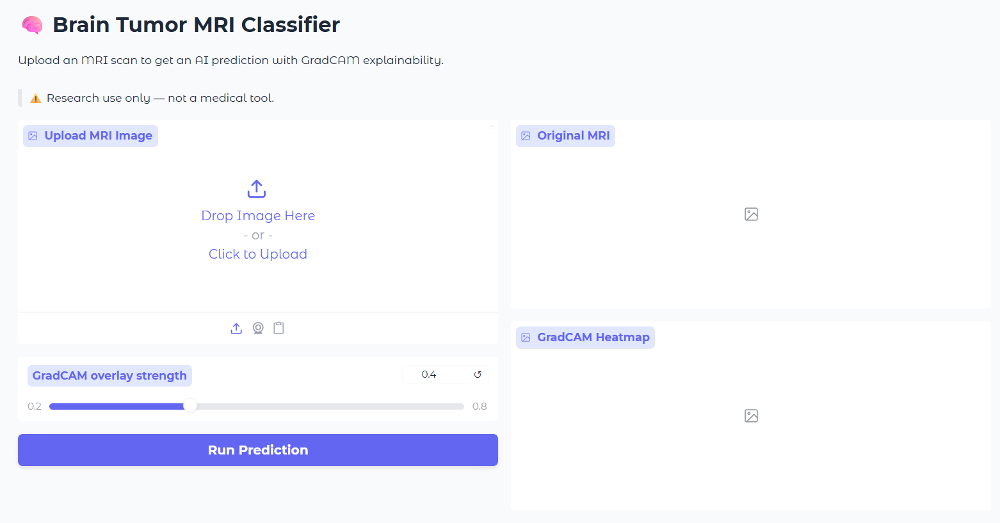
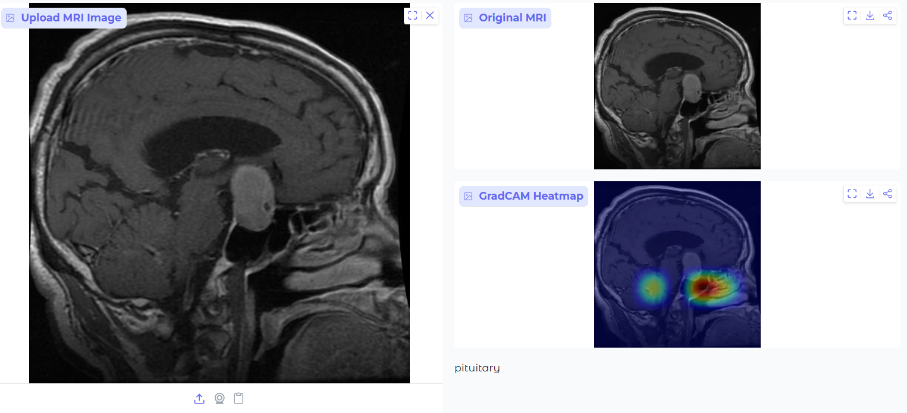
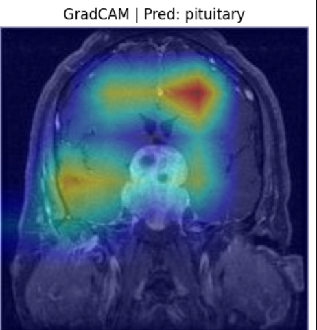
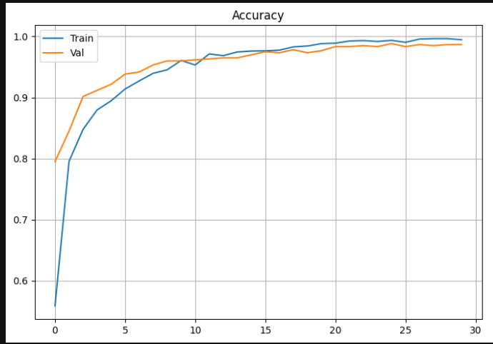
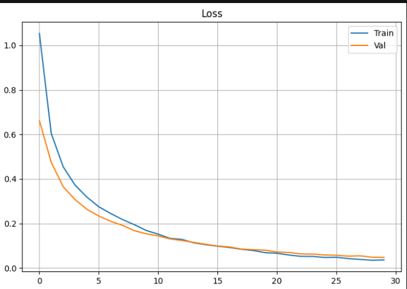
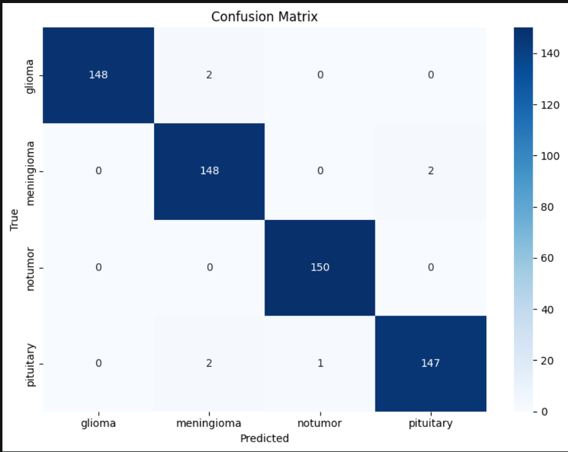

<div align="center">

# 🧠 SmartScan: AI-Driven Brain Tumor Detection

### *Leveraging Transfer Learning and Explainable AI for Intelligent MRI Classification*

> **Powered by `best_brain_tumor_model.keras` — a custom deep learning model developed using Transfer Learning with a frozen MobileNetV2 backbone and a task-specific classification head for brain MRI analysis.**

<p>
  
  
  
  
  
  
</p>

### 🚀 An end-to-end deep learning application that combines **Transfer Learning**, **custom model engineering**, and **Explainable AI** to classify brain MRI scans while visually explaining every prediction.

🌐 **Live Demo:** https://huggingface.co/spaces/ishaan05/brain-tumor-classifier

</div>

---

#  Project Preview

<p align="center">

</p>

---

#  Overview

Brain tumor diagnosis from MRI scans is a challenging task that demands expert interpretation and careful examination of complex anatomical structures. Manual analysis can be time-consuming, and subtle abnormalities may not always be immediately apparent.

**SmartScan** is an AI-powered medical imaging application developed to assist this process by automatically classifying brain MRI scans into four diagnostic categories while providing transparent visual explanations for every prediction.

At the heart of the application is **`best_brain_tumor_model.keras`**, a **custom-trained deep learning model** built using **Transfer Learning**. Instead of training an entire convolutional neural network from scratch, the model leverages pretrained visual representations from MobileNetV2 while incorporating a custom classification head specifically optimized for brain MRI analysis.

To promote transparency and trust, SmartScan integrates **GradCAM (Gradient-weighted Class Activation Mapping)**, allowing users to visualize which regions of an MRI scan contributed most strongly to the model's decision.

The result is a fast, interpretable, and interactive medical imaging assistant designed for educational and research purposes.

---

#  Model Used

SmartScan performs inference using **`best_brain_tumor_model.keras`**, a custom-trained deep learning model specifically developed for this project.

The model was created using a **Transfer Learning strategy** where:

- **MobileNetV2 pretrained on ImageNet** serves as the feature extraction backbone.
- The entire backbone remains **frozen during training**, preserving its learned visual representations.
- A custom classification head was designed and trained on brain MRI images.
- The fully trained network was exported as **`best_brain_tumor_model.keras`**, which is the model loaded by the application for every prediction.

This architecture combines the efficiency of pretrained computer vision models with task-specific learning tailored for medical image classification.

---

#  Key Features

-  Automatic classification of brain MRI scans into four categories
-  Custom Transfer Learning model (`best_brain_tumor_model.keras`)
-  Explainable AI through GradCAM visualizations
-  Adjustable GradCAM overlay intensity for interactive inspection
-  Downloadable GradCAM heatmaps
-  Support for JPG, JPEG, PNG, and NumPy (`.npy`) inputs
-  Lightweight and efficient inference pipeline
-  Interactive Gradio-powered user interface
-  Deployed on Hugging Face Spaces
-  Designed with transparency and interpretability in mind

---

#  Why SmartScan?

Many deep learning models produce predictions without revealing how those decisions were made.

SmartScan addresses this limitation by combining high-performance image classification with **Explainable AI**, enabling users to inspect the reasoning behind every prediction.

Rather than functioning as a black box, the application highlights the image regions that influenced the model while allowing users to dynamically adjust the heatmap intensity for clearer visualization.

This emphasis on interpretability makes SmartScan a practical demonstration of responsible AI principles applied to medical imaging.

---

#  Classification Categories

The model predicts one of four diagnostic classes:

| Category | Description |
|-----------|------------------------------------------------|
| 🔴 **Glioma** | Tumor originating from glial cells |
| 🟠 **Meningioma** | Tumor arising from the meninges surrounding the brain |
| 🟢 **No Tumor** | MRI scan without detectable tumor |
| 🟡 **Pituitary Tumor** | Tumor affecting the pituitary gland |

---

#  Model Architecture

The core inference engine powering SmartScan is **`best_brain_tumor_model.keras`**, a custom deep learning model created specifically for this project.

Rather than training an entirely new convolutional neural network, the model was developed using **Transfer Learning** with **MobileNetV2 pretrained on ImageNet** serving as a fixed feature extractor.

During training:

- The pretrained MobileNetV2 backbone was initialized with ImageNet weights.
- All backbone layers were **frozen** (`trainable = False`).
- A custom classification head was attached and optimized for brain MRI classification.

The classification head consists of:

- **GlobalAveragePooling2D**
- **Dense Layer (128 neurons, ReLU activation)**
- **Dropout (0.3)**
- **Softmax Output Layer (4 classes)**

Only these newly added layers were trained on the MRI dataset, producing the final deployed model:

```text
best_brain_tumor_model.keras
```

This saved model is loaded directly by the HuggingFace space during inference.

---

#  Transfer Learning Strategy

Training a deep neural network entirely from scratch requires massive datasets and significant computational resources.

To overcome these limitations, SmartScan adopts a **Transfer Learning** approach.

Instead of relearning low-level visual patterns, the project reuses the rich feature representations already learned by MobileNetV2 from millions of images while keeping its pretrained weights frozen.

A lightweight custom classification head is then trained specifically for brain MRI analysis.

This strategy offers multiple advantages:

- Faster convergence
- Reduced computational cost
- Better utilization of limited medical datasets
- Lower risk of overfitting
- Strong feature extraction capabilities
- Improved generalization to unseen MRI scans

The final trained network is exported as **`best_brain_tumor_model.keras`**, which serves as the production model used by SmartScan.

---

#  Data Preprocessing Pipeline

Before training and inference, every MRI image is standardized through a carefully designed preprocessing pipeline.

Each image undergoes:

- 📏 Resizing to **224 × 224 pixels**
- 🎨 Conversion to **RGB format**
- ⚖️ Normalization of pixel values to the range **[0,1]**

Converting images to RGB ensures a consistent three-channel representation compatible with the pretrained backbone, while normalization stabilizes training and improves model performance.

This preprocessing guarantees that all inputs are transformed into a uniform format before being analyzed by **`best_brain_tumor_model.keras`**.

---

#  Data Augmentation Strategy

Medical imaging datasets are often limited in size, making models susceptible to overfitting.

To improve robustness and encourage better generalization, SmartScan expands the effective training dataset through data augmentation.

The augmentation pipeline includes:

-  Horizontal Flipping
-  Rotation by +15°
-  Rotation by -15°
-  Brightness Enhancement
-  Brightness Reduction

These transformations expose the network to realistic variations while preserving clinically relevant anatomical information.

> **Important:** Data augmentation is applied **only during model training**. During inference, uploaded MRI scans are resized, converted to RGB, normalized, and passed directly to **`best_brain_tumor_model.keras`** without augmentation.

---

# 🔥 Explainable AI with GradCAM

Accurate predictions alone are insufficient in high-stakes domains such as healthcare.

SmartScan therefore integrates **Gradient-weighted Class Activation Mapping (GradCAM)** to provide visual explanations alongside every prediction.

GradCAM analyzes the gradients flowing through the final convolutional layers and projects them back onto the original MRI image, generating an activation heatmap that highlights the regions most responsible for the model's decision.

This transforms SmartScan from a black-box classifier into a transparent and interpretable AI system.

##  Interactive Heatmap Control

Unlike many implementations that generate fixed overlays, SmartScan allows users to dynamically adjust the GradCAM opacity using an interactive slider.

This enables:

- Better comparison between the original MRI and highlighted regions
- Easier inspection of subtle activations
- Flexible visualization for presentations and research
- Improved interpretability without obscuring anatomical structures

Users can also download the generated GradCAM visualization directly from the application.

---

#  End-to-End Inference Pipeline

```text
                   Brain MRI Scan
                          │
                          ▼
              Resize to 224 × 224 Pixels
                          │
                          ▼
                 Convert Image to RGB
                          │
                          ▼
              Normalize Pixel Values [0,1]
                          │
                          ▼
              best_brain_tumor_model.keras
        (Custom Transfer Learning Model)
                          │
                          ▼
             Brain Tumor Classification
                          │
               ┌──────────┴──────────┐
               │                     │
               ▼                     ▼
        Display Prediction     Generate GradCAM
               │                     │
               └──────────┬──────────┘
                          ▼
        Interactive Heatmap Visualization
```

---

#  Application Showcase

##  Home Screen

<p align="center">

</p>

---

##  Prediction Interface

<p align="center">

</p>

---

##  GradCAM Visualization

<p align="center">

</p>

The GradCAM module visually highlights the regions of the MRI scan that most strongly influenced the prediction while allowing users to adjust the overlay strength for enhanced interpretability.
#  Model Performance

The final model, **`best_brain_tumor_model.keras`**, was trained using a Transfer Learning approach and evaluated on a held-out test set to measure its classification capability across all four brain tumor categories.

Unlike relying solely on accuracy, SmartScan emphasizes comprehensive evaluation through multiple metrics to provide a more balanced assessment of model performance.

---

## 📈 Training Accuracy

<p align="center">

</p>

---

## 📉 Training Loss

<p align="center">

</p>

---

## 🎯 Confusion Matrix

<p align="center">

</p>

The confusion matrix provides a detailed view of how effectively the model distinguishes between Glioma, Meningioma, No Tumor, and Pituitary Tumor classes while identifying potential misclassifications.

---

#  Training Configuration

The final model was trained with the following architecture and hyperparameters.

| Component | Configuration |
|------------|------------------------------|
| **Final Model** | **`best_brain_tumor_model.keras`** |
| Backbone | MobileNetV2 (ImageNet Pretrained) |
| Transfer Learning | Frozen Backbone (`trainable = False`) |
| Global Pooling | GlobalAveragePooling2D |
| Dense Layer | 128 Units (ReLU) |
| Dropout | 0.3 |
| Output Layer | Softmax (4 Classes) |
| Optimizer | Adam |
| Learning Rate | 0.0001 |
| Loss Function | Categorical Crossentropy |
| Batch Size | 32 |
| Maximum Epochs | 15 |
| Early Stopping | Enabled (Patience = 5) |
| Model Saving | Best validation model (`best_brain_tumor_model.keras`) |

---

#  Performance Summary

| Metric | Value |
|----------|---------|
| Test Accuracy | **98.3%** |
| Precision | **0.99** |
| Recall | **0.99** |
| F1 Score | **0.99** |

Evaluating multiple metrics provides a more reliable understanding of the model's behavior than accuracy alone, particularly for multi-class medical image classification.

---

#  Project Structure

```text
SmartScan/
│
├── app.py
├── best_brain_tumor_model.keras
├── requirements.txt
├── README.md
│
├── assets/
│   ├── homepage.png
│   ├── prediction.png
│   ├── gradcam.png
│   ├── accuracy.png
│   ├── loss.png
│   └── confusion_matrix.png
│
└── notebooks/
```

---

#  Installation

## Clone the repository

```bash
git clone https://github.com/ishaan05/SmartScan.git
```

---

## Navigate into the project

```bash
cd SmartScan
```

---

##  Install Dependencies

Install all required packages using:

```bash
pip install -r requirements.txt
```

---

##  Run the Application Locally

Start the Gradio application with:

```bash
python app.py
```

Once launched, Gradio will automatically generate a local URL (typically `http://127.0.0.1:7860`) that can be opened in your web browser.

Alternatively, you can access the deployed version directly on **Hugging Face Spaces**:

**🌐 https://huggingface.co/spaces/ishaan05/brain-tumor-classifier**

---

#  How to Use

### Step 1 — Launch the Application

Run the application locally or open the deployed Hugging Face Space in your browser.

### Step 2 — Upload an MRI Scan

Upload a brain MRI image in any of the supported formats:

-  JPG
-  JPEG
-  PNG
-  NumPy (`.npy`)

### Step 3 — Automatic Preprocessing

The uploaded image is automatically:

- Resized to **224 × 224 pixels**
- Converted to **RGB format**
- Normalized to the **[0,1]** range

before being passed to **`best_brain_tumor_model.keras`**.

### Step 4 — AI Inference

The custom Transfer Learning model analyzes the MRI scan and predicts one of the following categories:

- 🔴 Glioma
- 🟠 Meningioma
- 🟢 No Tumor
- 🟡 Pituitary Tumor

### Step 5 — Explainable AI Visualization

GradCAM generates a visual heatmap showing which regions of the MRI contributed most to the model's prediction.

Users can interactively adjust the heatmap overlay intensity to inspect the model's attention more clearly.

### Step 6 — Download Results

The generated GradCAM visualization can be downloaded for documentation, presentations, or further analysis.

---

#  Live Demo

SmartScan is deployed on **Hugging Face Spaces**, allowing anyone to use the application directly without local installation.

### 🔗 Live Application

https://huggingface.co/spaces/ishaan05/brain-tumor-classifier

---

#  Technology Stack

## Programming Language

- Python

## Deep Learning

- TensorFlow
- Keras
- Transfer Learning
- MobileNetV2

## Computer Vision

- OpenCV
- NumPy
- Pillow

## Explainable AI

- GradCAM

## Visualization

- Matplotlib

## Deployment

- Hugging Face Spaces

---

#  Key Learning Outcomes

This project demonstrates practical implementation of:

- Deep Learning
- Transfer Learning
- Computer Vision
- Medical Image Classification
- Explainable AI (XAI)
- Convolutional Neural Networks
- Feature Extraction
- Model Fine-Tuning
- Interactive AI Applications
- Human-Centered AI Design

---

# 🔬 Why Explainability Matters

In healthcare applications, prediction accuracy alone is not sufficient.

Medical practitioners and researchers benefit from understanding *why* a model arrived at a particular decision.

SmartScan addresses this challenge by integrating GradCAM, allowing users to inspect the regions that contributed most strongly to each classification.

By combining prediction with explanation, the system becomes more transparent, interpretable, and trustworthy for educational and research purposes.

---

#  Future Improvements

SmartScan provides a solid foundation that can be extended into more advanced medical imaging applications.

Potential future enhancements include:

-  DICOM image support
-  Brain tumor segmentation
-  3D MRI volume processing
-  Automated clinical report generation
-  Multi-language interface
-  REST API deployment
-  Mobile application support
-  Ensemble deep learning models
-  PDF report export
-  Clinical decision support integration

---

#  Contributing

Contributions are always welcome.

If you'd like to improve SmartScan:

1. Fork the repository
2. Create a new feature branch
3. Commit your changes
4. Open a Pull Request

Constructive suggestions and improvements are greatly appreciated.

---

#  License

This project is released under the **MIT License**.

You are free to use, modify, and distribute this software under the terms of the license.

---

#  Medical Disclaimer

**SmartScan is intended exclusively for educational and research purposes.**

The predictions generated by **`best_brain_tumor_model.keras`** should **not** be considered a substitute for professional medical diagnosis, clinical evaluation, or treatment planning.

Always consult qualified healthcare professionals for medical decisions.

---

#  Project Highlights

SmartScan showcases the complete lifecycle of an AI-powered medical imaging system:

- ✅ Dataset preprocessing and normalization
- ✅ Data augmentation for improved generalization
- ✅ Transfer Learning using a frozen MobileNetV2 backbone
- ✅ Custom neural network design
- ✅ Training and deployment of **`best_brain_tumor_model.keras`**
- ✅ Explainable AI through GradCAM
- ✅ Interactive visualization with adjustable heatmap intensity
- ✅ Real-time deployment using Hugging Face Spaces

The project demonstrates how modern deep learning techniques can be combined with transparency and usability to create responsible AI systems for medical imaging.

---

<div align="center">

# ⭐ Star this Repository

If you found SmartScan useful or inspiring, consider giving it a ⭐ on GitHub.

It helps support the project and encourages continued development.

---

## 🧠 *SmartScan — AI-Driven Brain Tumor Detection*

### **Powered by `best_brain_tumor_model.keras`**

*A custom Transfer Learning model built on a frozen MobileNetV2 backbone with a task-specific classification head and enhanced with Explainable AI through GradCAM.*

**Built with ❤️ using Python, TensorFlow, HuggingFace, and Explainable AI.**

</div>
